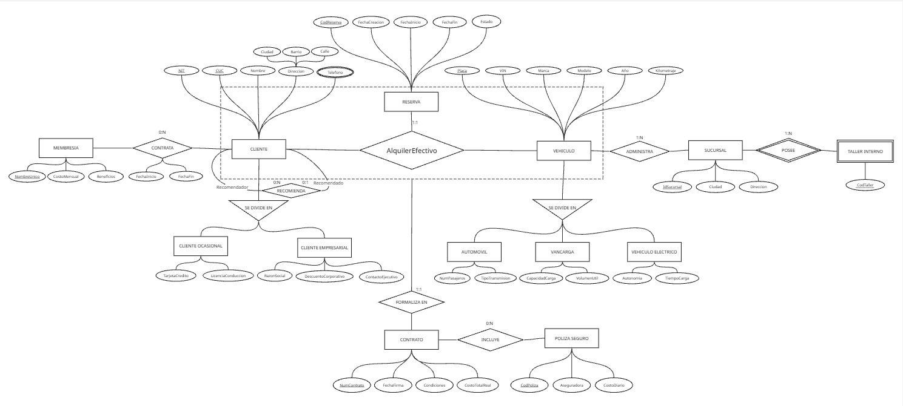

# 4. Modelo Entidad-Relación Extendido (E-R)

### Descripción Estructural del Modelo

* **Jerarquías de Especialización (Total y Disjunta):**
  * **CLIENTE:** Se especializa disjuntamente en `CLIENTE OCASIONAL` (atributos específicos: Tarjeta de Crédito, Licencia de Conducción) y `CLIENTE EMPRESARIAL` (Razón Social, Descuento Corporativo, Contacto Ejecutivo).
  * **VEHICULO:** Se especializa en `AUTOMOVIL` (Pasajeros, Transmisión), `VANCARGA` (Capacidad Ton, Volumen) y `VEHICULO ELECTRICO` (Autonomía, Tiempo Carga).

* **Entidad Débil:**
  * `TALLER_INTERNO` se modela como entidad débil dependiente de la entidad fuerte `SUCURSAL` mediante la relación `POSEE` ($1:N$), utilizando `Cod_Taller` como discriminador parcial.

* **Mecanismo de Agregación (Bloque Operativo Central):**
  * La transacción central del sistema consolida una relación ternaria `AlquilerEfectivo` entre `CLIENTE` ($1:N$), `VEHICULO` ($1:N$) y `RESERVA` ($1:1$).
  * Dicho grupo está delimitado dentro del **Marco de Agregación**, del cual deriva la relación $1:1$ `FORMALIZA EN` conectada a la entidad `CONTRATO`.

* **Relaciones Adicionales y Reglas de Negocio:**
  * **Relación Reflexiva:** `RECOMIENDA` sobre `CLIENTE` con roles definidos (`0:N` Recomendador / `0:1` Recomendado), manteniéndose independiente del marco de agregación.
  * **Cobertura de Seguros:** La entidad `CONTRATO` se vincula en una relación $N:M$ (`INCLUYE`) con `POLIZA_SEGURO`.
