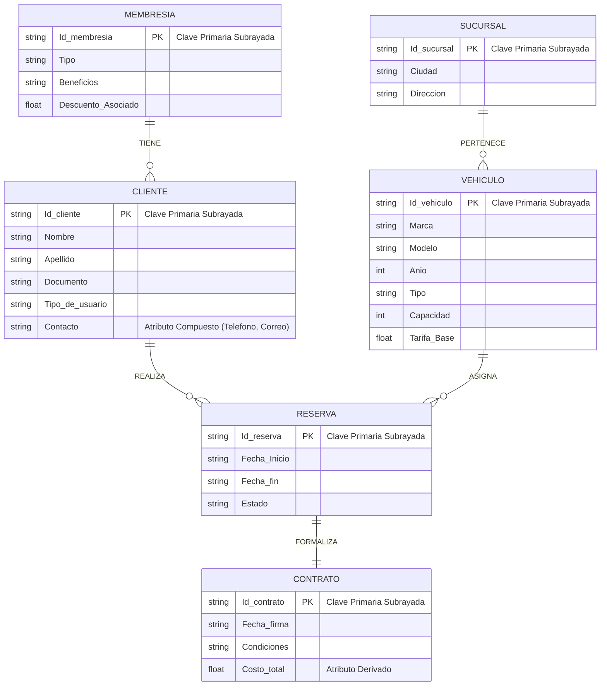

#  Modelo Entidad-Relación: Plataforma de Alquiler de Vehículos

---

## 1. Diagrama de la Base de Datos

A continuación se presenta el diagrama conceptual estructurado bajo la notación clásica de Peter Chen[cite: 4, 6]:

---

## 2. Notación y Estructura Técnica

| Elemento | Forma / Notación | Descripción y Aplicación en el Modelo |
| :--- | :--- | :--- |
| **Entidad Fuerte** | Rectángulo simple | Representa los conceptos principales del negocio (`Cliente`, `Vehiculo`, `Reserva`, etc.)[cite: 4, 6]. |
| **Relación** | Rombo | Describe las acciones de negocio entre entidades (`Realiza`, `Asigna`, etc.)[cite: 4, 6]. |
| **Atributo Simple** | Óvalo | Propiedad básica individual de una entidad o relación[cite: 4, 6]. |
| **Atributo Clave** | Óvalo con texto <u>subrayado</u> | Identificador único irrepetible (Clave Primaria / PK)[cite: 1, 4]. |
| **Atributo Compuesto** | Óvalo ramificado ("encapsulado") | Atributo divisible (`Contacto` $\rightarrow$ `Telefono`, `Correo`)[cite: 5]. |
| **Atributo Derivado** | Óvalo con borde punteado | Valor calculado (`Costo total` en `Contrato`)[cite: 4, 5]. |

---

## 3. Desglose de Entidades y Atributos

### 1. `Cliente` (Rectángulo)
* <u>`Id_cliente`</u> → Clave Primaria (Óvalo con texto <u>subrayado</u>)[cite: 1, 4].
* `Nombre` → Óvalo simple[cite: 4].
* `Apellido` → Óvalo simple[cite: 4].
* `Documento` → Óvalo simple[cite: 4].
* `Tipo de usuario` → Óvalo simple *(Ocasional, Empresarial, Administrador)*[cite: 4].
* `Contacto` → **Atributo Compuesto ("Encapsulado"):** Óvalo del cual se desprenden `Telefono` y `Correo`[cite: 5].

### 2. `Membresia` (Rectángulo)
* <u>`Id_membresia`</u> → Clave Primaria (Óvalo con texto <u>subrayado</u>)[cite: 1, 4].
* `Tipo` → Óvalo simple[cite: 4].
* `Beneficios` → Óvalo simple[cite: 4].
* `Descuento Asociado` → Óvalo simple[cite: 4].

### 3. `Vehiculo` (Rectángulo)
* <u>`Id vehiculo`</u> → Clave Primaria (Óvalo con texto <u>subrayado</u>)[cite: 1, 4].
* `Marca` → Óvalo simple[cite: 4].
* `Modelo` → Óvalo simple[cite: 4].
* `Año` → Óvalo simple[cite: 4].
* `Tipo` → Óvalo simple[cite: 4].
* `Capacidad` → Óvalo simple[cite: 4].
* `Tarifa Base` → Óvalo simple[cite: 4].

### 4. `Sucursal` (Rectángulo)
* <u>`Id sucursal`</u> → Clave Primaria (Óvalo con texto <u>subrayado</u>)[cite: 1, 4].
* `Ciudad` → Óvalo simple[cite: 4].
* `Direccion` → Óvalo simple[cite: 4].

### 5. `Reserva` (Rectángulo)
* <u>`Id_reserva`</u> → Clave Primaria (Óvalo con texto <u>subrayado</u>)[cite: 1, 4].
* `Fecha Inicio` → Óvalo simple[cite: 4].
* `Fecha fin` → Óvalo simple[cite: 4].
* `Estado` → Óvalo simple *(Pendiente, Confirmado, Cancelado)*[cite: 4].

### 6. `Contrato` (Rectángulo)
* <u>`Id_contrato`</u> → Clave Primaria (Óvalo con texto <u>subrayado</u>)[cite: 1, 4].
* `Fecha firma` → Óvalo simple[cite: 4].
* `Condiciones` → Óvalo simple[cite: 4].
* `Costo total` → **Atributo Derivado:** Óvalo con borde punteado *(calculado según días de alquiler, tarifa base y descuento aplicado)*[cite: 4, 5].

---

## 4. Relaciones y Cardinalidades

* **`<Tiene>` (entre `Membresia` y `Cliente`):**
  * **Cardinalidad 1 : N** (Un plan de membresía puede pertenecer a varios clientes; un cliente se suscribe a una sola membresía activa)[cite: 4, 6].
* **`<Pertenece>` (entre `Vehiculo` y `Sucursal`):**
  * **Cardinalidad N : 1** (Un vehículo está asignado físicamente a una sucursal; una sucursal administra múltiples vehículos)[cite: 4, 6].
* **`<Realiza>` (entre `Cliente` y `Reserva`):**
  * **Cardinalidad 1 : N** (Un cliente puede generar varias reservas; cada reserva le pertenece a un solo cliente)[cite: 4, 6].
* **`<Asigna>` (entre `Reserva` y `Vehiculo`):**
  * **Cardinalidad N : 1** (Una reserva asigna un único vehículo; un vehículo puede tener múltiples reservas en distintas fechas)[cite: 4, 6].
* **`<Formaliza>` (entre `Contrato` y `Reserva`):**
  * **Cardinalidad 1 : 1** (Una reserva confirmada formaliza un contrato único de alquiler)[cite: 4, 6].

---

## 💻 5. Código DDL

